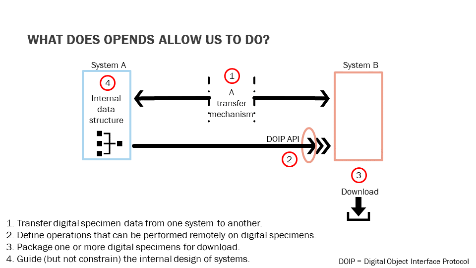

# Use cases for openDS 

This document describes some of the use cases foreseen as driving the specification work on openDS.

*In a later iteration, these use case should probably be organised into those of interest from the point of view of being enabling for new kinds of work and those more directly relevant to persons that will use specimens for science. May be cateforise them and technically enabling and scientifically enabling. In the former category we are thinking of the cases 1 - 4 shown in the following illustratrion.* 

*The cases listed below fall into the latter category.*

## Use case 1: Finding/accessing more information about specimens

open Digital Specimens provide opportunities for accessing more information about or related to natural science specimens (preserved plants, animals, fossils, rocks, minerals, etc.) with easier access leading to better workflows and better research. As a curated and authoritative digital twin for the physical specimen, a Digital Specimen with its package of links to other data could be a considerably more reliable and efficient information source than crawling potential databases manually for information about and derived from the physical specimen.

## Use case 2: Easier consumption/use of data and improved curation

Higher degrees of standardization, as epitomized by the openDS specification make it easier to consume and use data and improve curation. But such standardization but must accommodate multiple scenarios (e.g., preserved specimens, living specimens, jars of specimens, splitting of specimens, cases where there is no specimen but other objects like photos, illustrations, recordings, etc., and cases where the original specimen has been lost or destroyed). Not everything needs to be standardized but to benefit, you need something more standard for additional (supplementary) content.

## Use case 3: Support transformation of working practices

e.g., in moves towards more community-oriented curatorial practices for data about and derived from specimens.

*To be further elaborated.*

## Use case 4: Linking information from/to other (sub-)disciplines

Linking information makes taxonomic work easier and enables linkage of data and information from and to other disciplines. Community curation saves you a lot of effort in making these links compared to the case where every collection must make all the (semantic) links on their own.

## Use case 5: Facilitate tracking of specimen use

Persistently identified open Digital Specimens in conjunction with third-party services can facilitate tracking of specimen use e.g., when mentioned in publications by means of its persistent identifier.

## Use case 6: Crediting work performed
Work performed in relation to a specimen, including gathering in the first place or deriving new data/information through analysis can be unambiguously attributed to the correct person(s) e.g., in conjunction with a researcher's ORCID iD. This can  provide incentives to create open Digital Specimens in the first place.

## Use case 7: Align specimen concepts and provide strong foundation across institutions

Digital Specimens can help to align specimen concepts and specimen metadata structure across institutions, as well as providing a strong foundation for attaching annotations/interpretations and records of loans and visits.

## Use case 8: A single virtual collection and many thematic collections

Handling specimens openly on the Internet offers opportunities for establishing a single virtual collection across multiple participating institutions (such as the European Collection Objects Index to be established by the DiSSCo research infrastructure) as well as the possibility to curate Digital Specimens in multiple thematic collections simultaneously - for example all specimens collected in Charles Darwin's HMS Beagle voyages. The latter is not easily achievable for physical objects.

## Use case 9: Assess data suitability and/or reliability
Provenance data supplied with an open Digital Specimen can help to assess suitability and/or reliability of data for specific purposes. Available metadata can inform about possible usage restrictions and/or obligations associated with use (licenses, Nagoya protocol, etc.).

## Use case n: ... ...

... ... 

## Use case n: ... ...

To be completed. 

END.