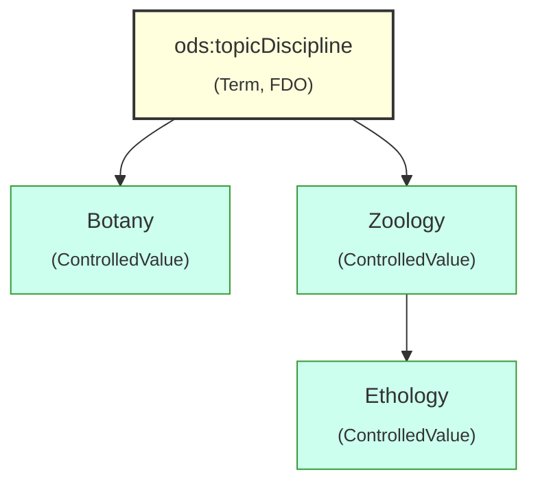

# FAIR Terms and Controlled Values for DiSSCo

Here we have the specifications, schemas, and examples for implementing **FAIR Terms** and **Controlled Values** as **FAIR Digital Objects (FDOs)** in the **DiSSCo infrastructure**. These components form the semantic foundation for structuring and interpreting digital specimen data in a machine-actionable and interoperable manner.

##  Background

A key aspect of implementing FAIR Digital Objects is the introduction of **standardised terms** and **controlled vocabularies** in the data schemas. These are essential for:

*  **Disambiguation** – removing uncertainty in data fields
*  **Discovery** – enabling better search and filtering
*  **Interoperability** – harmonising schemas across infrastructures like GBIF, COL, BOLD, ENA and others
*  **Machine readability** – supporting automated processing, validation, and integration

Due to evolving requirements in the **Digital Specimen (DS)** lifecycle and use cases across DiSSCo, we introduce **additional terms** not currently available in standards such as **Darwin Core (DwC)** and **ABCD(EFG)**. These are expressed and managed as **FAIR Digital Objects** with persistent identifiers and rich metadata.

## Definitions (adapted from TDWG’s maintenance specification)

* **Term** – A class, property, or concept identified by a Persistent Identifier (PID, typically a Handle). A term includes:

  * Human-readable label (`skos:prefLabel`)
  * Machine-actionable definition (`skos:definition`)
  * Metadata such as version, status, and creation/modification history
    
* **Controlled Value** – A member of a restricted vocabulary used to constrain the values of certain terms (e.g., `"Botany"` as a value for `ods:topicDiscipline`)

See [TDWG Maintenance Specification](https://github.com/tdwg/vocab/blob/master/vms/maintenance-specification.md) for background.

## DiSSCo Design Principles

1. **Two key types**:
   We use only two core types:

   * `ods:Term`
   * `ods:ControlledValue`
     to reduce confusion across varying naming conventions like “concepts”, “vocabularies”, or “terms”.

2. **FAIR Digital Objects (FDOs)**:
   Each term and controlled value is implemented as an FDO with:

   * A persistent identifier (PID) using Handle.net
   * A resolvable URI
   * A machine-readable schema (JSON, JSON-LD)
   * A defined FDO Type (e.g., `ods:Term`, `ods:ControlledValue`)

3. **PID structure and naming**:

   * The `ods` namespace maps to:
     `https://hdl.handle.net/20.500.1025/`
   * Each PID follows the format:
     `https://hdl.handle.net/20.500.1025/TermName`
     e.g., `https://hdl.handle.net/20.500.1025/hasEntityRelationships`

   While encoding semantics in PID strings is not ideal, it improves usability in JSON-LD and makes terms compact and human-readable (`ods:DigitalSpecimen`).

4. **PID resolution infrastructure**:

   * All terms are **dereferenceable** via Handle resolution
   * Human- and machine-readable content is served through services like:
     `https://terms.dissco.tech/digital-specimen-terms#DigitalSpecimen`
   * This is analogous to `rs.tdwg.org` vocabulary resolution

5. **Alignment with Semantic Web and FAIR principles**:

   * Uses SKOS/RDFS/OWL properties for definition, deprecation, and versioning
   * Provides `@context` for JSON-LD support
   * Enables easy mapping to RDF/LOD ecosystems

6. **Consistency with TDWG and GBIF practices**:

   * Controlled values follow the same logic as [GBIF vocabularies](https://registry.gbif.org/vocabulary)
   * Aligns with TDWG definion and best practices and use concepts like `skos:broader`, `skos:narrower`, and `inScheme`
  

### Linking Terms to Controlled Values and Supporting Hierarchies

In DiSSCo’s FAIR model, each **term** (e.g. `ods:topicDiscipline`) can reference a set of **controlled values** (e.g. *Botany*, *Zoology*) that are also modeled as FAIR Digital Objects (FDOs). This supports both machine-actionable validation and semantic interoperability.

To enable this:

* Each **Term** includes a `rdfs:range` or `ods:hasControlledValues` property linking to the associated controlled values (e.g. `hdl:20.500.1025/Botany`).
* Each **ControlledValue** is defined using SKOS, including:

  * `skos:prefLabel` for multilingual naming
  * `skos:definition` for meaning
  * `skos:broader` and `skos:narrower` for semantic hierarchy

For example, *Zoology* may have a `skos:narrower` relation to *Ethology*, expressing domain-specific depth without embedding structure in string values.

This avoids the ambiguity of flat vocabularies and aligns with recommendations from [TDWG Vocabulary Maintenance Specification](https://github.com/tdwg/vocab) and broader semantic web practices.

## Schemas

* `term.json`: Schema for defining an `ods:Term`
* `controlledValue.json`: Schema for defining an `ods:ControlledValue`

##  Examples

* `ods:topicDiscipline`
  with values such as:

  * `https://hdl.handle.net/20.500.1025/topicDiscipline/Botany`
  * `https://hdl.handle.net/20.500.1025/topicDiscipline/Ecology`

## Future Enhancements

* Validating term usage and value constraints
* SKOS hierarchical vocabularies (e.g., `Botany → Plant Ecology`)
* Integration into FDO Profiles and Digital Specimen workflows
